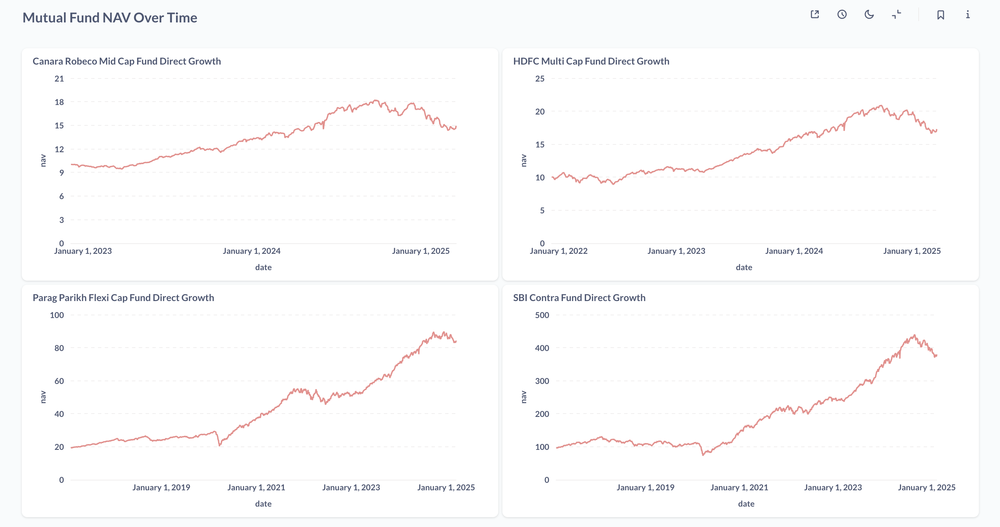

+++
date = '2025-03-20T06:47:32+05:30'
draft = false
title = 'How I Built My Own Mutual Funds Tracker With Metabase'
+++

At the end of every financial year, I like to consolidate my mutual fund holdings. Like most personal finance enthusiasts, I started with [Google Finance](https://www.google.com/finance/) to track my portfolio. It worked well initially, but over time, I outgrew it. It lacked critical financial calculations like XIRR, which I needed for measuring returns on irregular investments like SIPs and lumpsum investments. I tried Google Sheets, but the experience of building charts and dashboards wasn’t as straightforward as I wanted. I wanted a solution where I could push my data into a database and construct dashboards and charts with insights.

That's when I stumbled upon [Metabase](https://www.metabase.com/). It's an open source BI tool that allows you to create visually appealing reports from raw SQL queries.

### Setting Up Metabase

1. I created a PostgreSQL database to store my mutual fund transactions, NAV History, and active SIPs.
2. I used [MFAPI](https://www.mfapi.in/) to fetch NAV history and set up a cron job to update it daily.
3. I then deployed Metabase on a VPS, so I could access my dashboards anytime, anywhere.

PS: This was my first real experience with **vibe coding**, and I'm sold. I spent nearly 24 hours designing a schema, figuring out how to populate NAV data, and deploying Metabase on a VPS. This would have easily taken me at least a week without Cursor. Safe to say, I wouldn't be cancelling my $20 subscription anytime soon.

Here’s a screenshot of the dashboard I built to visualize the NAV history of various mutual funds. I obviously cannot share my actual investment dashboards, so I hope these should give you a good idea of what's possible.

Resources:

- [GitHub Repo](https://github.com/Nilesh2000/FinDash)
