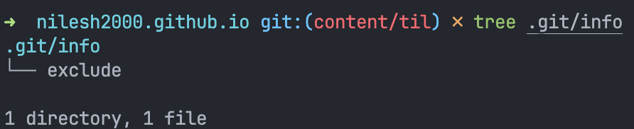

+++
date = '2025-01-21T07:27:29+05:30'
draft = false
title = 'Exclude Local Files Without Creating a .gitignore'
+++

Sometimes, I maintain a `todo.md` in the root of my projects for personal use. Not everyone does this, so I can't add it to the `.gitignore` file. Doing that would affect the whole team's configuration, and this is just my thing.

Instead, I add this file to `.git/info/exclude`. It works like a local `.gitignore` and keeps the file from being staged. Since its only in my setup, nothing gets committed to the repo. It's like having my own personal `.gitignore`!

## Sources
- https://medium.com/@dave_lunny/exclude-files-from-git-without-committing-changes-to-gitignore-986fa712e78d
- https://docs.github.com/en/get-started/getting-started-with-git/ignoring-files#excluding-local-files-without-creating-a-gitignore-file
