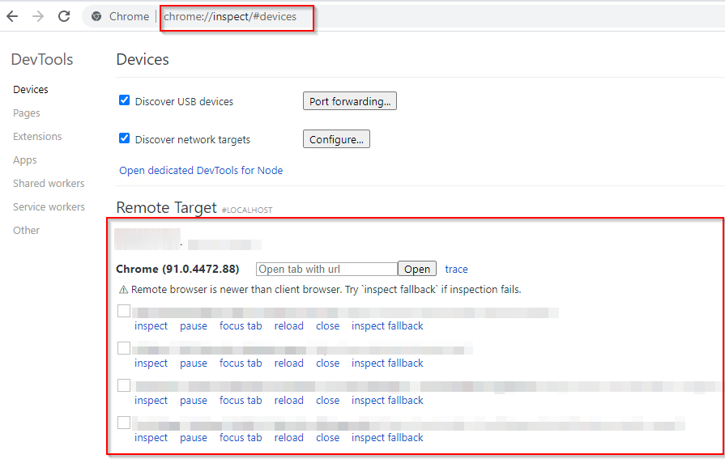

+++
date = '2025-01-22T21:51:49+05:30'
draft = false
title = 'Excluding Personal Page Views from Umami Analytics'
+++

I recently set up [Umami](https://umami.is/) as the analytics engine for my website. While it was easy to setup, I wanted to ensure my own page views weren’t being tracked.

On desktop, this was straightforward: I ran `localStorage.setItem('umami.disabled', 1);` in the browser’s developer console.

However, I also wanted to achieve the same result on my mobile device. This required a bit more effort since accessing the developer console on a phone isn’t as simple.

Here’s how I did it:

1. Connected my **Samsung Galaxy M30 (Android 10)** to my laptop via USB.
2. Enabled developer mode by navigating to Settings > About Phone > Software Information and tapping Build Number multiple times.
3. In the new Developer Options menu, toggled USB Debugging.
4. On my laptop, I opened `chrome://inspect#devices` on Chrome.
5. This displayed all active Chrome tabs on my mobile. I clicked Inspect on the desired tab, accessed the developer console, and ran:
`localStorage.setItem('umami.disabled', 1);`

## Sources
- https://stackoverflow.com/questions/37256331/is-it-possible-to-open-developer-tools-console-in-chrome-on-android-phone
